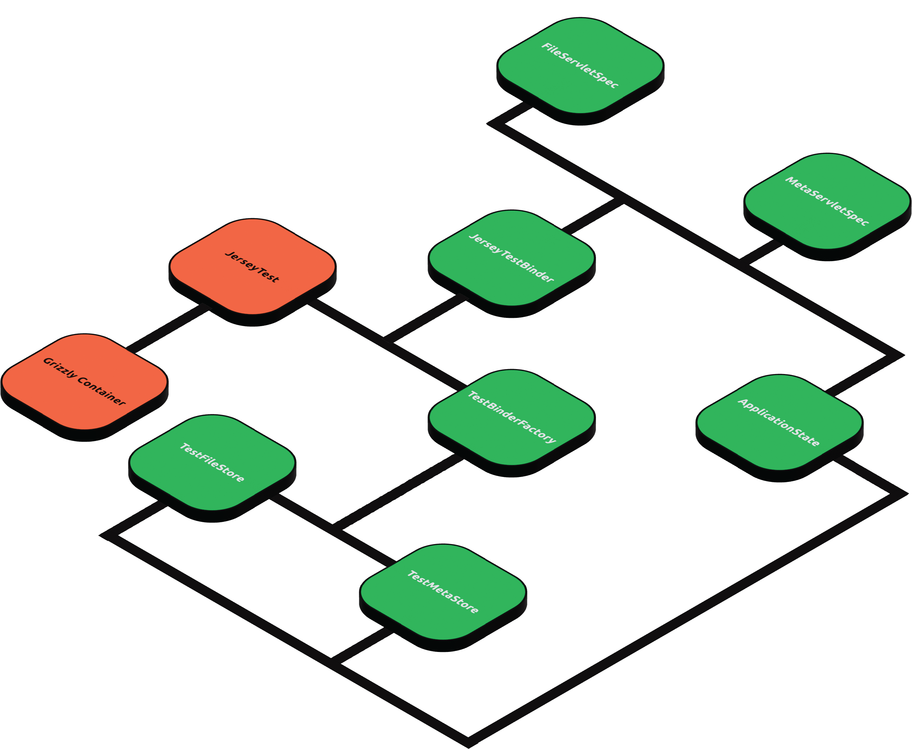

Athena Core Module
==================

athena-core defines the most important Webservice components:

* Binding
* Bound interfaces
* Webservice resources, i.e. endpoints

Servlet Testing Documentation
-----------------------------

> The design of athena-core tests, servlet tests in particular, draws extensively from
> [fili](https://github.com/yahoo/fili/blob/master/fili-core/src/test/java/com/yahoo/bard/webservice/application/JerseyTestBinder.java)
> 
> One noticeable deviation is that since some of Fili's classes have made it possible for themselves to be mutable,
> which Athena doesn't do, the stubbing is defined not on these classes, but on
> [ApplicationState](./src/test/java/com/qubitpi/athena/application/ApplicationState.java), which is a modified
> adaption of Fili ApplicationState

[Servlet-related testing](./src/test/groovy/com/qubitpi/athena/web/endpoints) is carried out using
[Jersey Test Framework](https://qubitpi.github.io/jersey-guide/2022/07/11/jersey-test-framework.html).



Each `***ServletSpec.groovy` follows the following pattern to setup, run, and shutdown tests:

### 1. Initialize ApplicationState

Test specs initializes test data and mocking through
[ApplicationState](./src/test/java/com/qubitpi/athena/application/ApplicationState.java) in `setup()`

```groovy
def setup() {
    ApplicationState applicationState = new ApplicationState();
    applicationState.metadataByFileId = ...
    applicationState.queryFormatter = ...
    applicationState.mutationFormatter = ...
    
    ...
}
```

* `applicationState.metadataByFileId` initializes GraphQL DataFetcher data
* `queryFormatter` transforms a (file ID, metadata field list) pair to a native GraphQL query
* `mutationFormatter` transforms a (file ID, metadata object) pair to a native GraphQL query that persists a new
  metadata to database (or just in-memory that usually suffices in testing scenarios)

### 2. Create Test Harness

```groovy
def setup() {
    ...

    jerseyTestBinder = new JerseyTestBinder(true, applicationState, ***Servlet.class)
}
```

Executing the statement above will start a [Grizzly container](https://javaee.github.io/grizzly/). After that all Athena 
endpoints are ready to receive test requests.

The first boolean argument (`true`) is a flag to indicate whether or not, on executing the statement, servlet container
starts immediately. If we would like to defer the startup, change that to `false` and manually start the container later
by

```groovy
jerseyTestBinder.start()
```

Internally [JerseyTestBinder](./src/test/java/com/qubitpi/athena/application/ApplicationState.java) sets 
[TestBinderFactory](./src/test/java/com/qubitpi/athena/application/TestBinderFactory.java) to bind those data and
behaviors into the actual test

> Note that the [JerseyTestBinder](./src/test/java/com/qubitpi/athena/application/ApplicationState.java) creates separate 
  container for each test. Setup method is named `setup()` and teardown method `cleanup()` by Groovy Spock convention.

### 3. Run Tests

To send test request in order to test endpoints, use `JerseyTestBinder.makeRequest` method, which returns a native
javax rs ws request object:

```groovy
def "File meta data can be accessed through GraphQL GET endpoint"() {
    when: "we get meta data via GraphQL GET"
    String actual = jerseyTestBinder.makeRequest(
            "/metadata/graphql",
            [query: URLEncoder.encode("""{metaData(fileId:"$FILE_ID"){fileName\nfileType}}""", "UTF-8")]
    ).get(String.class)

    then: "the response contains all requested metadata info without error"
    new JsonSlurper().parseText(actual) == new JsonSlurper().parseText(expectedMultiFieldMetadataResponse())
}
```

### 4. Teardown Tests

The teardown shuts down test cnotainer as well as cleaning up all ApplicationStates we defined in
[step 1](#1-initialize-applicationstate)

```groovy
def cleanup() {
    // Release the test web container
    jerseyTestBinder.tearDown()
}
```

Troubleshooting
---------------

### Adding Custom Resources to ResourceConfig

```
java.lang.IllegalStateException: org.glassfish.jersey.server.model.ModelValidationException: Validation of the application resource model has failed during application initialization.
[[FATAL] No injection source found for a parameter of type public javax.ws.rs.core.Response

...

Caused by: org.glassfish.jersey.server.model.ModelValidationException: Validation of the application resource model has failed during application initialization.
```

Athena uses ResourceConfig type for configuration. We need to register the `MultiPartFeature`. Instead of using [Athena ResourceConfig](./src/main/java/com/qubitpi/athena/application/ResourceConfig.java), servlet test spec configures with the native
[Jersey ResourceConfig](https://github.com/eclipse-ee4j/jersey/blob/master/core-server/src/main/java/org/glassfish/jersey/server/ResourceConfig.java). The reason is so that we could bind certain resource classes that we only need in a test spec to enhance test efficiency.

Athena ResourceConfig registers MultiPartFeature by default, whereas Jersey ResourceConfig does not. We could register
this resource as an extra resource class using

```groovy
jerseyTestBinder = new JerseyTestBinder(true, applicationState, FileServlet.class, MultiPartFeature.class)
```

Note that along with the `FileServlet` resource that's going to be registered and tested, `MultiPartFeature` will also
got registered by Jersey ResourceConfig.
