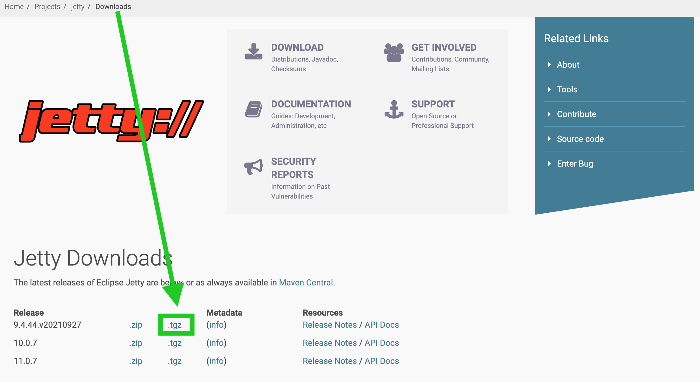

Athena Quick Start
==================

Build From Source
-----------------

### Create a Deployable War File

We build the ".war" File first by navigating to athena project root and execute

```bash
cd path-to-athena-root/
```

and compile the project

```bash
mvn clean package
```

Successfully executing the command above shall generate a ".war" file under 
`path-to-athena-root/athena-example/athena-example-books/target/athena-example-books-<athena-version>.war`, where
is the version of the athena, for example `1.0.0`, please make sure to replace `<athena-version>` with one of our
release versions.

## Install Jetty

### Download Jetty

At [download page](https://www.eclipse.org/jetty/download.php), pick up a `.tgz` distribution, we will use
"9.4.44.v20210927" release as an example:



### Install Jetty

Put the `tar.gz` file into a location of your choice as the install path and extract the Jetty binary using

    tar -czvf jetty-distribution-9.4.44.v20210927.tar.gz

## Drop the ".war" File into the Jetty "webapp"

    cd jetty-distribution-9.4.44.v20210927/webapps/
    mv /path/to/.war .

Then rename the war file to "ROOT.war", the reason of which is so that the context path would be root context - `/`,
which is a common industry standard.

> 📋 Setting a Context Path
>
> The context path is the prefix of a URL path that is used to select the context(s) to which an incoming request is
> passed. Typically a URL in a Java servlet server is of the format
> "http://hostname.com/contextPath/servletPath/pathInfo", where each of the path elements can be zero or more "/"
> separated elements. If there is no context path, the context is referred to as the **root context**. The root context
> must be configured as "/" but is reported as the empty string by the servlet
> [API `getContextPath()` method](https://www.eclipse.org/jetty/).
>
> How we set the context path depends on how we deploy the web application (or `ContextHandler`). In this case, we
> configure the context path by **naming convention**:
>
> If a web application is deployed using the WebAppProvider of the DeploymentManager without an XML IoC file, then **the
> name of the WAR file is used to set the context path**:
>
> * If the WAR file is named "myapp.war", then the context will be deployed with a context path of `/myapp`
> * **If the WAR file is named "ROOT.WAR" (or any case insensitive variation), then the context will be deployed with a
    >   context path of `/`**
    > If the WAR file is named "ROOT-foobar.war" (or any case insensitive variation), then the context will be deployed with
    > a context path of / and a
    > [virtual host](https://www.eclipse.org/jetty/documentation/jetty-9/index.html#configuring-virtual-hosts) of "foobar"

## Start the Webservice

    cd ../
    java -jar start.jar

> 📋 To specify the port that container exposes for our app, we could use
>
> ```bash
> java -jar start.jar -Djetty.port=8081
> ```

## Firing The First Request

```bash
brew install --cask graphiql
```

Open up a browser and hit "http://localhost:8081/???"，then in the Jetty log we will see
