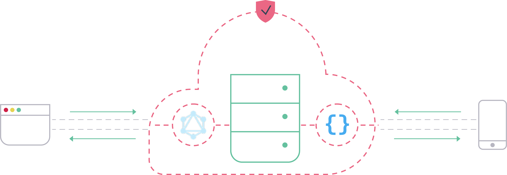
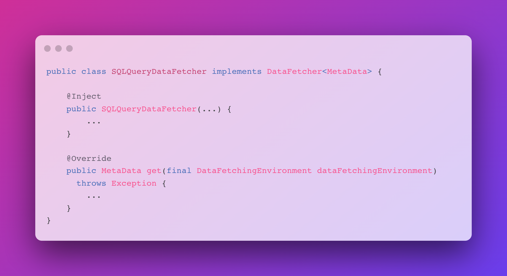

  

    

      <h2>
        File {json:api} & Meta Data GraphQL web
        services for file management
      </h2>
      <a href="pages/guide/v1/01-welcome.html">
        <button type="button" class="btn btn-primary text-light my-3">Get Started</button>
      </a>
      

        
      

    

  

  
  <h4 class="mx-2">Athena is a Java library that lets you setup object storage webservice with minimal effort.</h4>

  
How to use it

  

    

      

        

          

            <h4>1. Star Athena 😉</h4>
          

        

      

      

        

          

            <h4>2. Pickup a File Store</h4>
            

              Choose either Swift or HDFS file store that Athena already offered for you or implement a custom file
              store against any arbitrary database as file storage
            

          

        

        

          
        

      

      

        

          

            <h4>3. Define GraphQL Data Fetchers</h4>
            
Plug-in access layer to file meta data through GraphQL Java

          

        

        

          
        

      

      

        

          

            <h4>4. Bind Them</h4>
            
Make instances of your file store and data fetchers accessible through Jersey binding.

          

        

        

          
        

      

      

        

          

            <h4>5. Deploy & Enjoy</h4>
            
That's it - you are ready to deploy and query your file data with JSON or GraphQL requests.

          

        

        

          
        

      

    

  

  

    <h2>Want to learn more?</h2>
    <a href="pages/guide/v1/01-welcome.html">
      <button type="button" class="btn btn-primary text-light mb-2">Documentation</button>
    </a>
    
Or see our features below

  

  

    
Features

    

      

        
      

      

        <h4>Production Quality</h4>
        

          Quickly build and deploy production quality web services that expose your data as a service. Athena APIs
          support complex filtering rules, sorting, and pagination.
        

      

      

        
      

    

    

      

      

      

    

    

      

        
      

      

        <h4>Security Comes Standard</h4>
        
Controlling access to your data is as simple as defining your rules.

      

    

    

      

      

      

    

    

      

        
      

      

        <h4>Mobile Friendly</h4>
        

          Fetch entire object graphs in a single round trip. Subscribe to changes in your data model in realtime. Only
          requested elements of the file meta data are returned.
        

      

      

        
      

    

    

      

      

      

    

    

      

        
      

      

        <h4>Single Atomic Request</h4>
        
Athena supports multiple data model mutations in a single request in GraphQL.

      

    

    

      

      

      

    

    

      

        
      

      

        <h4>Analytic Queries</h4>
        

          Athena supports analytic queries against files crafted with its powerful semantic layer. Athena API's work
          natively with <a href="https://github.com/yahoo/fili">Fili</a> to visualize, explore, and report on your
          data.
        

      

      

        
      

    

    

      

      

      

    

    

      

        
      

      

        <h4>Open API</h4>
        

          Explore, understand, and compose queries against your Athena API through generated <a>Swagger</a>
          documentation or GraphQL schema.
        

      

    

    

      

      

      

    

    

      

        
      

      

        <h4>Customize</h4>
        
Customize the behavior of file and meta data operations with pluggable implementations through Jersey.

      

      

        
      

    

    

      

      

      

    

    

      

        
      

      

        <h4>Storage Agnostic</h4>
        

          Athena is agnostic to your particular persistence strategy. Use Swift/HDFS or provide your own implementation
          of a data store.
        

      

    

    

      

      

      

    

    

      

        
      

      

        <h4>Open Source</h4>
        

          Athena is 100% open source and available on <a href="https://github.com/paiondata/athena">Github</a>.
          Released under the commercial-friendly <a href="pages/license.html">Apache License, Version 2.0</a>.
        

      

      

        
      

    

  

  <h2>Opinionated API's for web & mobile</h2>
  
Improve the velocity and quality of your team's work.

  <a href="pages/guide/v1/01-welcome.html">
    <button type="button" class="btn btn-primary text-light">Get Started</button>
  </a>

  

    

      

        
      

      

        <a href="pages/guide/v1/01-welcome.html">Documentation</a>
        <a href="pages/license.html">Licensing</a>
      

      

        <a href="https://discord.com/widget?id=1001320502960324658&theme=dark">Community</a>
      

      

        <a href="https://github.com/QubitPi?tab=packages&repo_name=athena">Releases</a>
      

      

        <a href="https://github.com/paiondata/athena">
          <button type="button" class="btn btn-secondary github">
            
            Github
          </button>
        </a>
      

    

  

